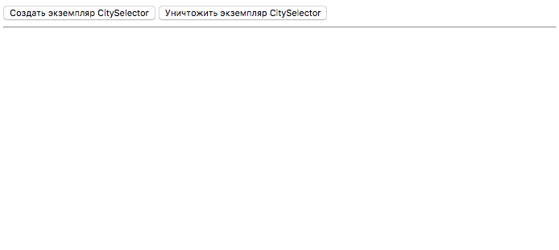

# Компонент выбора региона и города
Реализуйте выбиралку региона и города. Компонент может выглядеть как-то так:



## Порядок работы
### Оценка
Перед тем, как приступить к задаче, оцените ее по времени и отправьте письмо с оценкой тому, от кого вы ее получили. Пример оценки: задача займет около `N` часов, решение смогу прислать такого-то числа.

### Работа с кодом
**Не форкайте этот репозиторий!**

Скачайте или склонируйте код на свой компьютер, из него создайте репозиторий в своем Гитхаб-аккаунте и выполните задачу в нем.

## Запуск сервера и сборщика
Команды для запуска:

```sh
npm install
npm start
```

Шаблон заработает на `localhost:8080`.

* Данные нужно запрашивать с [JSON API-сервера](https://github.com/typicode/json-server) по адресу `localhost:3000`.
* [WebpackDevServer](https://webpack.js.org/configuration/dev-server/) отдает статические ресурсы (js, html и пр.) с `localhost:8080`.

## Логика компонента
* При создании компонента появляется кнопка «Выбрать регион».
* По нажатию на кнопку появляется список регионов (запросить аяксом с `http://localhost:3000/regions`).
* При выборе региона появляется список его населенных пунктов (запросить аяксом с `http://localhost:3000/localities/[regionId]`).
* При выборе населенного пункта появляется кнопка «Сохранить». Если населенный пункт не выбран, кнопка должна быть заблокирована (свойство `disabled`).
* При сохранении `id` региона и название населенного пункта отсылаются **синхронным** POST-запросом на `http://localhost:3000/selectedRegions`.

## Особенности
* По кнопке «Создать экземпляр CitySelector» нужно инициализировать компонент.
* По кнопке «Уничтожить экземпляр CitySelector» нужно удалять компонент и возвращать все как было до его создания.
* Компонент должен уметь общаться с другими компонентами. То есть нужен способ рассказать любому количеству других компонентов о том, какой выбран регион и населенный пункт. Реализуйте этот функционал вставляя выбор пользователя в `<div id="info"></div>`. Этот див скрыт, показывайте его при создании компонента и скрывайте при удалении.
* Нужно учесть, что компонентов может быть несколько на странице и каждый должен быть независимым.
* Использовать нужно только чистый JS (желательно ES6) и jQuery. Без плагинов и других библиотек.
* Помимо компонента `CitySelector` с выбиралкой города можно создавать столько вспомогательных компонентов, сколько посчитаете нужным.

## Жизненный цикл
Помните о жизненном цикле компонента:
* Компонент может быть создан и удален (create, destroy).
* Компонент может иметь разные состояния (stateful): то выбрано одно, то выбрано другое, то вообще ничего не выбрано.
* Компоненты на странице должны каким-то образом общаться между собой. Например, список товаров должен знать, какой регион выбран, чтобы показать правильный ассортимент.

## Структура модуля
Модуль хранится в своей директории, именованной с большой буквы. `index.js` — основной файл модуля:

```
src/
    app.js
    CitySelector/
        index.js
        style.less
        ...
```

Модуль должен экспортировать конструктор (через класс или функцию).

Компонент должен принимать следующие параметры:
* `id` элемента, в котором он появится (это будет основной элемент компонента)
* URL для запроса списка регионов
* URL для запроса списка городов в регионе
* URL для сохранения выбора

В `app.js` есть пример создания. Вы можете инициализировать его по-своему.

## Стиль кода
В проекте есть настройки для ESLint и Stylelint. Код должен им соответствовать.
